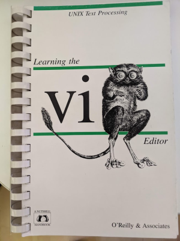
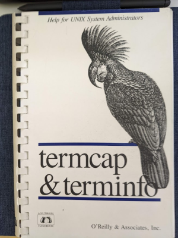

# Documentation

## Ex/Vi Manpages
The manpages are created form the nroff code in the 
GitHub repository [n-t-roff/heirloom-ex-vi](https://github.com/n-t-roff/heirloom-ex-vi).

* [ex.1](software/ex.1.md)
* [vi.1](software/vi.1.md)

## My Books
This books are still on my shelf.

| Learning the vi Editor - 4th Edition | Termcap and Terminfo - 3rd Edition   |
|:------------------------------------ | :----------------------------------- |
| Linda Lamb                           | John Strang, Tim O'Reilly, Linda Mui |
| June 1988                            | April 1988                           |
| O'Reilly & Associates, Inc.          | O'Reilly & Associates, Inc.          |
| ISBN 0-937175-17-X                   | ISBN 0-93717522-6                    |
|  |  |

## Books/Documents
* [An Introduction to Display Editing with Vi](https://ex-vi.sourceforge.net/viin/paper.html)
* [Learning the vi 5th Ed.](https://docstore.mik.ua/orelly/unix/vi/index.htm)
* [Learning the vi and Vim Editors 7th Ed.](https://doc.lagout.org/operating%20system%20/linux/Learning%20the%20vi%20and%20Vim%20Editors%2C%207e.pdf)
* [The Termcap Manual 2nd Ed.](https://www.gnu.org/software/termutils/manual/termcap-1.3/html_mono/termcap.html)

